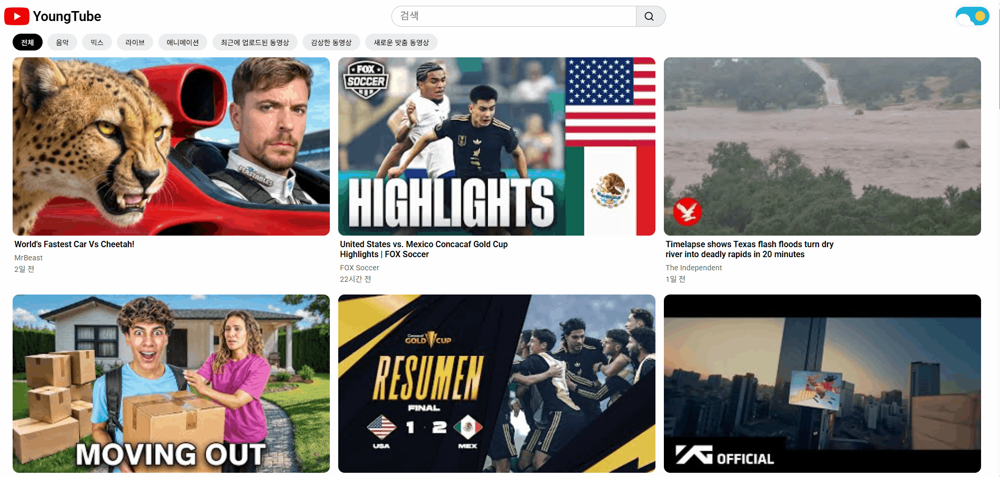
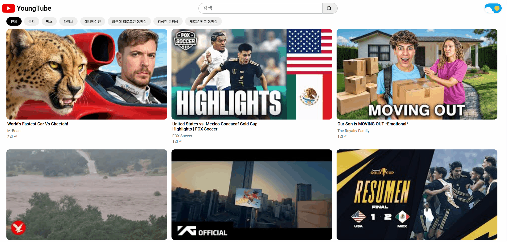
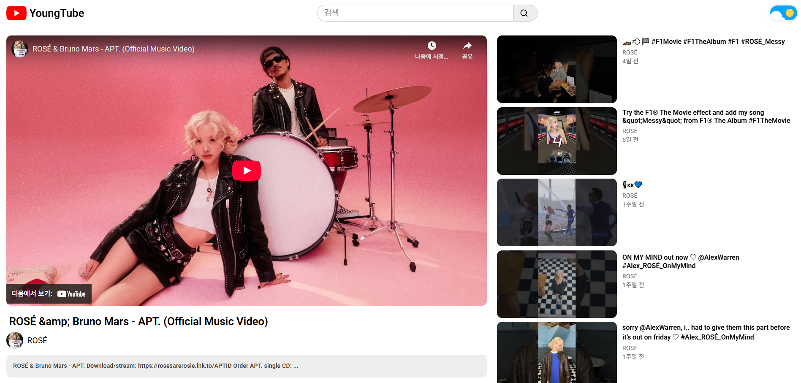
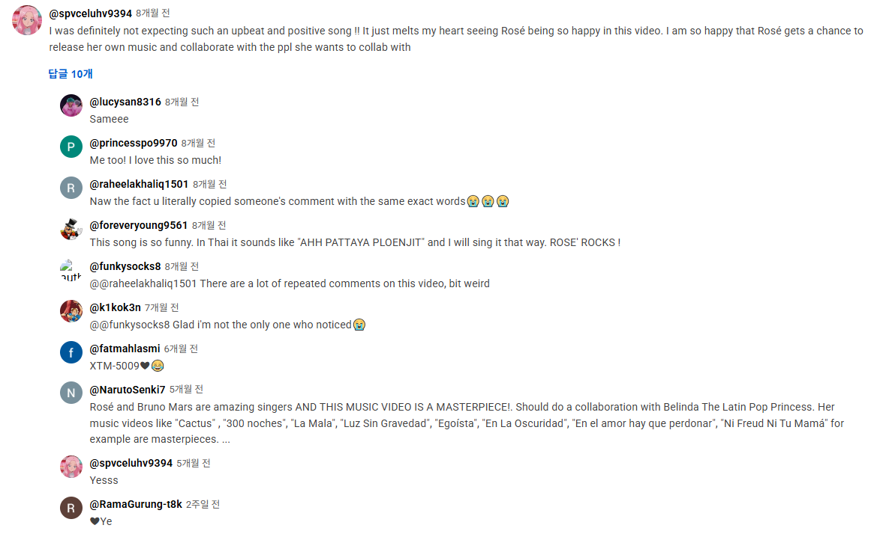
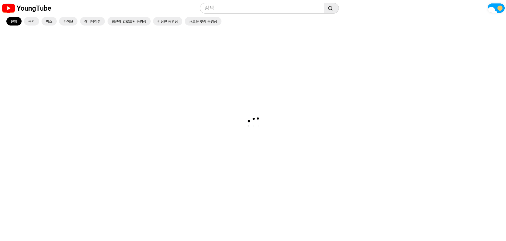

# YoungTube

  

 

## 👑 프로젝트 요약
유튜브 인터페이스를 리액트로 제작한 프로젝트입니다. 
**YouTube Data API**를 활용해 실제 데이터를 연동하고 **동영상 시청, 검색, 관련 동영상 탐색, 댓글&답글, 다크 모드** 등 다양한 기능을 구현했습니다.
  

## 🖥 화면 구성

 
<h3 style="display:inline; margin-left:4px">1️⃣ Home</h3>

 <h4>📷 이미지</h4>
 

 
<h3 style="display:inline; margin-left:4px">2️⃣ Search</h3>

 <h4>📷 이미지</h4>
 

 
<h3 style="display:inline; margin-left:4px">3️⃣ Video Detail</h3>

 <h4>📷 이미지</h4>
 

 
<h3 style="display:inline; margin-left:4px">4️⃣ Comment & Reply</h3>

 <h4>📷 이미지</h4>
 

 
<h3 style="display:inline; margin-left:4px">5️⃣ Loading</h3>

 <h4>📷 이미지</h4>
 

 
<h3 style="display:inline; margin-left:4px">6️⃣ Error</h3>

