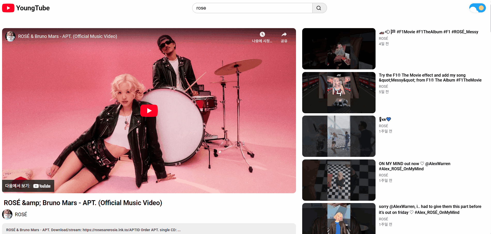
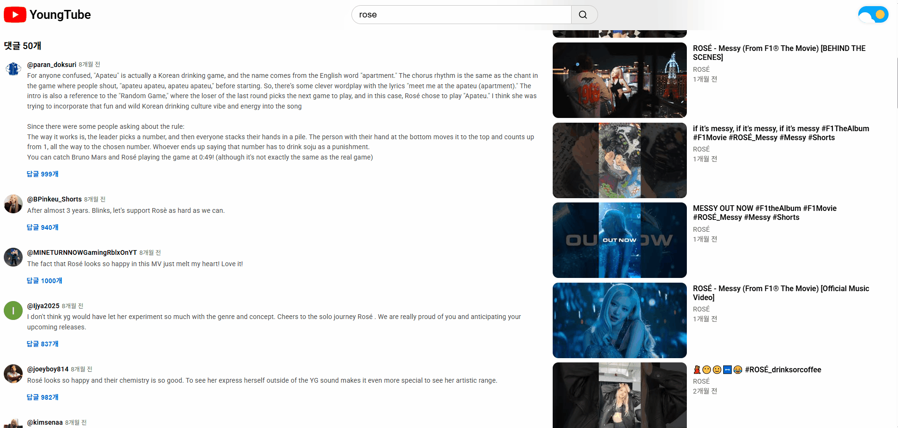
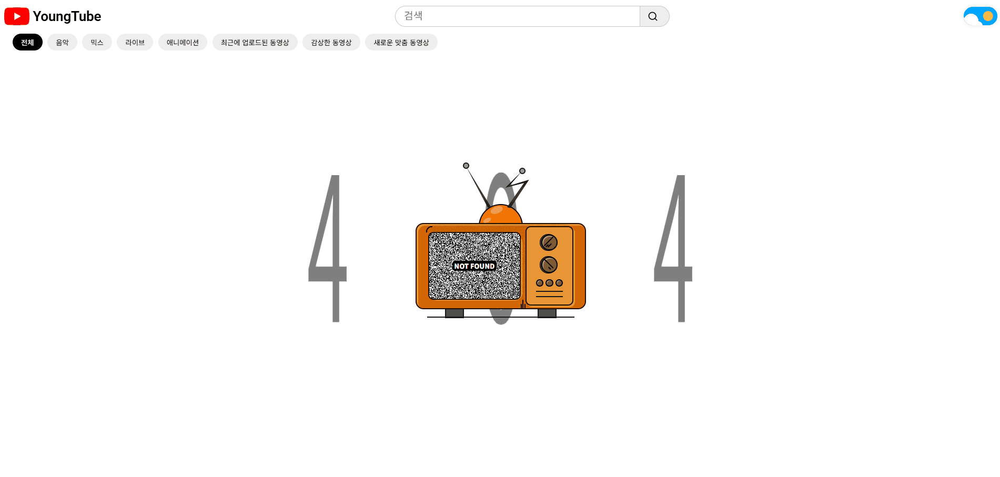

# YoungTube
- 유튜브 인터페이스를 **React**와 **YouTube Data API**로 제작한 프로젝트입니다.
- **검색, 동영상 시청, 관련 동영상 탐색, 댓글과 답글, 다크 모드** 등 다양한 기능이 포함되어 있으며 **반응형 UI**로 구현되었습니다.
<br/><br/>

## 🖥 화면 구성
<details>
 <summary><h3 style="display:inline; margin-left:4px">1️⃣ 홈 화면</h3></summary>
 
</details>

<details>
 <summary><h3 style="display:inline; margin-left:4px">2️⃣ 검색 화면</h3></summary>
 
</details>

<details>
 <summary><h3 style="display:inline; margin-left:4px">3️⃣ 비디오 상세 화면</h3></summary>
 
</details>

<details>
 <summary><h3 style="display:inline; margin-left:4px">4️⃣ 댓글, 답글 화면</h3></summary>
 
</details>

<details>
 <summary><h3 style="display:inline; margin-left:4px">5️⃣ 로딩 화면</h3></summary>
 
</details>

<details>
 <summary><h3 style="display:inline; margin-left:4px">6️⃣ 에러 화면</h3></summary>
 
</details>
<br/>

## 💡 주요 기능 및 구현
- **API 버전**: YouTube Data API v3
- **인증 방식**: API Key

<details>
 <summary><h3 style="display:inline; margin-left:4px">홈 페이지</h3></summary>
 
 - **사용 API:** `videos?key={개인 API키}&part=snippet&maxResults=25&order=date&chart=mostPopular`
 - **설명:** 인기 동영상을 최신순으로 25개만 불러와 홈 화면에 표시합니다.
</details>

<details>
 <summary><h3 style="display:inline; margin-left:4px">키워드 검색</h3></summary>
 
 - **사용 API:** `search?key={개인 API키}&part=snippet&maxResults=25&order=date&type=video&q=rose`
 - **설명:** 키워드로 검색한 동영상을 최신순으로 25개만 불러와 홈 화면에 표시합니다.
</details>

<details>
 <summary><h3 style="display:inline; margin-left:4px">비디오 상세 페이지, 관련 동영상</h3></summary>
 
 - **사용 API:** `videos, search API에서 불러온 데이터 사용`
 - **설명:** 동영상에 대한 자세한 정보(동영상 제목, 채널 썸네일, 채널명, 게시일)를 제공 받아 비디오 상세 화면에 표시합니다.
</details>

<details>
 <summary><h3 style="display:inline; margin-left:4px">유튜버 프로필 이미지</h3></summary>
 
 - **사용 API:** `channels?key={개인 API키}&part=snippet&id={channelId}`
 - **설명:** 채널 운영자의 프로필 이미지 주소를 가져와 비디오 상세 화면에서 이미지로 보여줍니다.
</details>

<details>
 <summary><h3 style="display:inline; margin-left:4px">댓글</h3></summary>
 
 - **사용 API:** `commentThreads?key={개인 API키}&part=snippet&videoId={videoId}&maxResults=50&order=relevance`
 - **설명:** 댓글에 대한 자세한 정보(총 댓글수, 총 답글수, 작성자 프로필 이미지, 작성자 이름, 댓글 내용, 게시일)를 50개만 불러와 관련성 높은순으로 댓글 화면에 표시합니다.
</details>

<details>
 <summary><h3 style="display:inline; margin-left:4px">답글</h3></summary>
 
 - **사용 API:** `comments?key={개인 API키}&part=snippet&parentId={commentId}`
 - **설명:** 답글에 대한 자세한 정보(작성자 프로필 이미지, 작성자 이름, 댓글 내용, 게시일)를 50개만 불러와 답글 화면에 표시합니다.
</details>

<details>
 <summary><h3 style="display:inline; margin-left:4px">로딩 페이지</h3></summary>
 
 - **설명:** 데이터가 로딩 중일 때 사용자에게 로딩 상태를 보여줍니다.
</details>

<details>
 <summary><h3 style="display:inline; margin-left:4px">에러 페이지</h3></summary>
 
 - **설명:** 잘못된 접근 또는 오류 발생 시 사용자에게 에러 메시지를 보여줍니다.
</details>

<details>
 <summary><h3 style="display:inline; margin-left:4px">테마 기능</h3></summary>
 
 - **설명:** 토글 버튼으로 다크/라이트 모드로 전환할 수 있으며 localStorage에 저장하여 상태를 유지합니다.
</details>
<br/>

## 🌐 라우터 구조
<table>
    <thead>
      <tr>
        <th>페이지</th>
        <th>경로</th>
        <th>설명</th>
      </tr>
    </thead>
    <tbody>
      <tr>
        <td>홈</td>
        <td>/</td>
        <td>비디오 목록 표시</td>
      </tr>
      <tr>
        <td>검색 결과</td>
        <td>/:keyword</td>
        <td>검색 결과과 일치하는 비디오 목록 표시</td>
      </tr>
      <tr>
        <td>비디오 상세</td>
        <td>/watch/:videoId</td>
        <td>선택한 비디오의 상세 정보, 댓글, 답글, 관련 영상 표시</td>
      </tr>
      <tr>
        <td>에러</td>
        <td>/test-error</td>
        <td>에러 발생 시 표시</td>
      </tr>
      <tr>
        <td>로딩</td>
        <td>/test-loading</td>
        <td>API 요청 중 딜레이 되는 경우 표시</td>
      </tr>
    </tbody>
  </table>
  <br/>

## 🛠 기술 스택
#### 🕹 프론트엔드
- **프레임워크/빌드:**
  &nbsp;
  
- **라우팅:** 
- **상태 관리:**
  &nbsp;
  
- **통신:** 
- **API:** YouTube Data API
- **스타일링:** 
- **테스트:**
  &nbsp;
  &nbsp;
  
<br/>

#### 🚀 배포 도구
- **플랫폼:**
  
<br/>

## 🧩 폴더 구조
```
📦src
 ┣ 📂app
 ┃ ┣ 📂context
 ┃ ┃ ┗ 📜YoutubeApiContext.jsx          // 전역 상태 공유를 위한 Context 생성
 ┃ ┣ 📂provider
 ┃ ┃ ┗ 📜YoutubeApiProvider.jsx         // Context Provider 및 API 로직 관리
 ┃ ┗ 📜App.jsx
 ┣ 📂entities
 ┃ ┣ 📂comment
 ┃ ┃ ┗ 📂ui
 ┃ ┃ ┃ ┣ 📂CommentItem                  // 개별 댓글 컴포넌트
 ┃ ┃ ┃ ┃ ┣ 📜CommentItem.jsx            
 ┃ ┃ ┃ ┃ ┗ 📜CommentItem.module.css
 ┃ ┃ ┃ ┗ 📂ReplyItem                    // 개별 답글 컴포넌트
 ┃ ┃ ┃ ┃ ┣ 📜ReplyItem.jsx
 ┃ ┃ ┃ ┃ ┗ 📜ReplyItem.module.css
 ┃ ┗ 📂video
 ┃ ┃ ┗ 📂ui
 ┃ ┃ ┃ ┣ 📂ChannelInfo                  // 채널 운영자 정보 표시(프로필 이미지, 이름)
 ┃ ┃ ┃ ┃ ┣ 📜ChannelInfo.jsx
 ┃ ┃ ┃ ┃ ┗ 📜ChannelInfo.module.css
 ┃ ┃ ┃ ┣ 📂Comments                     // 댓글, 답글 리스트 컴포넌트
 ┃ ┃ ┃ ┃ ┣ 📜Comments.jsx
 ┃ ┃ ┃ ┃ ┗ 📜Comments.module.css
 ┃ ┃ ┃ ┣ 📂RelatedVideos                // 관련 비디오 리스트 컴포넌트
 ┃ ┃ ┃ ┃ ┣ 📜RelatedVideos.jsx
 ┃ ┃ ┃ ┃ ┗ 📜RelatedVideos.module.css
 ┃ ┃ ┃ ┗ 📂VideoCard                    // 동영상 썸네일 카드 컴포넌트
 ┃ ┃ ┃ ┃ ┣ 📜VideoCard.jsx
 ┃ ┃ ┃ ┃ ┗ 📜VideoCard.module.css
 ┣ 📂features
 ┃ ┗ 📂api
 ┃ ┃ ┣ 📜fakeYoutubeClient.js           // 테스트용 Mock Data 정의
 ┃ ┃ ┣ 📜youtube.js                     // API 명세 및 파라미터 정의
 ┃ ┃ ┗ 📜youtubeClient.js               // 실제 API 호출 로직 정의
 ┣ 📂pages
 ┃ ┣ 📂Error                            // 에러 페이지
 ┃ ┃ ┣ 📂styles
 ┃ ┃ ┃ ┗ 📜index.module.css
 ┃ ┃ ┗ 📜index.jsx
 ┃ ┣ 📂Loading                          // 로딩 페이지
 ┃ ┃ ┣ 📂styles
 ┃ ┃ ┃ ┗ 📜index.module.css
 ┃ ┃ ┗ 📜index.jsx
 ┃ ┣ 📂Root                             // 공통 레이아웃(헤더, 메인 컨테이너)
 ┃ ┃ ┗ 📜index.jsx
 ┃ ┣ 📂VideoDetail                      // 비디오 상세 페이지(영상, 채널, 댓글, 답글)
 ┃ ┃ ┣ 📂styles
 ┃ ┃ ┃ ┗ 📜index.module.css
 ┃ ┃ ┗ 📜index.jsx
 ┃ ┗ 📂Videos                           // 비디오 목록 페이지
 ┃ ┃ ┣ 📂styles
 ┃ ┃ ┃ ┗ 📜index.module.css
 ┃ ┃ ┗ 📜index.jsx
 ┣ 📂shared
 ┃ ┣ 📂lib
 ┃ ┃ ┗ 📂timeago                        // 시간 포맷 변환 유틸 함수
 ┃ ┃ ┃ ┗ 📜index.js
 ┃ ┗ 📂ui
 ┃ ┃ ┣ 📂header                         // 헤더 컴포넌트
 ┃ ┃ ┃ ┣ 📜Header.jsx
 ┃ ┃ ┃ ┗ 📜Header.module.css
 ┃ ┃ ┣ 📂popup                          // 팝업창 컴포넌트
 ┃ ┃ ┃ ┣ 📜Popup.jsx
 ┃ ┃ ┃ ┗ 📜Popup.module.css
 ┃ ┃ ┣ 📂theme                          // 테마 토글 버튼 컴포넌트
 ┃ ┃ ┃ ┣ 📜Theme.jsx
 ┃ ┃ ┃ ┗ 📜Theme.module.css
 ┃ ┃ ┗ 📜index.js                       // 공용 UI 컴포넌트 인덱스
 ┣ 📜index.css                          // 전역 스타일 정의
 ┗ 📜main.jsx
```
<br/>

## 🎯 실행 방법
- **Node.js 18 이상 권장**
- **YouTube Data API v3 개인 키 필요**
<br/>

### API Key 설정
- Google Cloud Console에서 **YouTube Data API v3**를 활성화하고 키를 발급받습니다.
- 프로젝트 루트에 `.env`파일을 만들고 아래와 같이 설정하세요.
```
VITE_YOUTUBE_API_KEY=발급 받은 키
```

### 실행
```bash
# 패키지 설치
npm install   # 또는 npm i

# 개발 서버 실행
npm run dev
```
<br/>

## 📍 홈페이지 주소
https://young-tube.netlify.app/

<br/>

## 📚 Git 사용 규칙
- `{}`는 기호가 아니라 설명을 의미합니다.
<br/>

### Branch
- **feat/{기능 설명}:** 새로운 기능을 개발하는 브랜치 → feat/error, fet/video-card
- **style/{기능 설명}:** 스타일 관련 수정하는 브랜치 → style/popup
<br/>

### Commit Message
- **feat: {작업 내용 요약}:** 새로운 기능 추가 → feat: 에러 컴포넌트 추가
- **style: {작업 내용 요약}:** 스타일 관련 수정 → style: 에러 컴포넌트 스타일링
- **fix: {작업 내용 요약}:** 버그 수정 → fix: search 파라미터 수정
- **chore: {작업 내용 요약}:** 빌드 설정 수정 → chore: api key 추가
